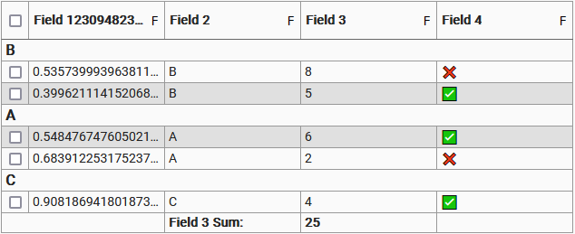

# table

Vanilla JS data table component.



## Usage

`npm i @samhuk/table`

### Usage in JS/TS
Basic usage (default column options, no custom configuration, etc.):

```typescript
import { createTable } from '@samhuk/table'

const element = document.createElement('div')

// Create table with 3 column and 3 rows of data
const table = createTable({
  columnOrdering: ['A', 'B', 'C'],
  initialData: [
    { a: 1, b: 2, c: 3 },
    { a: 4, b: 5, c: 6 }
    { a: 7, b: 8, c: 9 }
  ]
})

element.appendChild(table.rendered.element)
```

### Importing Styles

There are two main ways of importing the styles for the component into your project. One can either:

1. `import` the scss entrypoint or css bundle file into your .ts or .js file. This is supported by all the main bundlers out there like webpack and esbuild as long as you have the required loader/plugin for scss or css files configured.
    ```typescript
    // Import the scss entrypoint file from the src
    import 'node_modules/@samhuk/table/src/component/styles/index.scss'
    // Import the css bundle file
    import 'node_modules/@samhuk/table/dist/styles.css'
    ```
2. `@import` the scss entrypoint file into your scss file.
    ```scss
    @import '~@samhuk/table/src/component/styles/index.scss';
    ```

## Features

* Column sorting
* Column filter button
* Footer row
* Row grouping (with group header row)
* Customizable row and cell rendering
* More

## Development Deployment

One must have node and npm installed. Get node from [nodejs.org](https://nodejs.org/en/download/).

Run `npm i`

Run `npm start`

Try navigating to localhost:4001.
